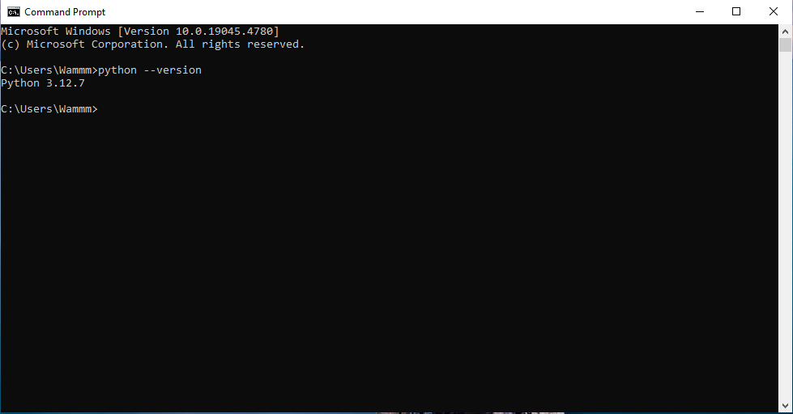

# Install Python Interpreter

Berdasarkan cara menjalankan kode program, bahasa pemrograman dibagi mnenjadi dua jenis, yaitu :

- Bahasa pemrograman kompilasi

Bahasa pemrograman komplikasi adalah bahasa pemrograman yang kodenya di terjemahkan langsung oleh kompiler menjadi kode mesin. Kode mesin sendiri adalah bahasa yang dapat langsung dipahami dan dijalankan oleh komputer. Proses kompilasi sendiri menghasilkan file eksekusi yang dapat langsung dijalankan tanpa perlu adanya interpreter. Bahasa pemrograman yang tercatat menggunakan kompiler antara lain **C**, **C++**, **C#**, **Java**, **Kotlin**, dan **Rust**.

- Bahasa pemrograman interpretasi

Bahasa pemrograman yang kodenya diterjemahkan secara langsung oleh interpreter menjadi intruksi yang dapat dipahami oleh komputer. Proses interpretasi biasanya dilakukan saat program dijalankan. Contoh bahasa pemrograman interpretasi antara lain **Javascript**, **Ruby**, **Perl**, **PHP**, dan **Python** itu sendiri.

Oleh karena itu, pada artikel ini akan dijelaskan bagaimana cara menginstall interpretasi pada Windows dan MacOS

## Windows

- Tahap pertama adalah mengecek terlebih dahulu apakah di Windows kalian sudah ada Python interpreter atau belum. Caranya adalah buka CMD Prompt, lalu search pada search bar
  

  Jika CMD sudah terbuka, maka ketikkan : "python --version"
  
  Jika muncul keterangan seperti pada gambar, maka laptop kalian sudah memiliki python. Versi Python yang terinstall dapat diihat pada CMD.

- Apabila laptop anda belum terinstall Python, maka ikuti langkah berikut. Yang pertama downoad terlebih dahulu file python untuk windows, dapat di download pada link berikut : <https://www.python.org/downloads/>
  

- Kemudian pilih versi python yang ingin anda install. Umumnya versi python yang diinstall menggunakan versi terbaru, akan tetapi beberapa versi windows yang lama dapat menggunakan versi python sebelumnya. Jadi tidak masalah jika versi python teman-teman masih menggunakan versi yang lama (Disarankan untuk menggunakan **minimal** versi 3.12). Teman-teman bisa scroll kebawah untuk melihat atau mencari versi python yang lama atau yang diinginkan.

- Langkah selanjutnya teman-teman bisa langsung klik download pada versi yang diinginkan (disini saya menggunakan versi terbaru).
  

- Lalu scroll lagi kebawah sampai ketemu windows installer, pilih 32 aau 64 (biasanya 64) tergantung system yang kalian gunakan.
  

- Selanjutnya buka atau run file installer Python yang sudah kalian download. Jangan lupa untuk centang bagian **Add Python 3.13 to PATH**
  

* Tunggu hingga proses instalasi selesai.

  

* Setelah proses instalasi selesai, teman-teman dapat cek langsung versi python yang sudah berhasil terinstall. Teman-teman juga dapat mencoba menjalankan python di CMD dengan cara mengetik **python**. Contohnya seperti gambar dibawah ini.
  

  Sampai sini proses installasi python pada windows telah selesai. Untuk teman-teman pengguna MacOS dapat mengikuti tutorial berikut <https://www.youtube.com/watch?v=HSAm6s10G7g&list=PLZS-MHyEIRo59lUBwU-XHH7Ymmb04ffOY&index=3>

**Sekian tutorial singkat ini, Terima kasih**
