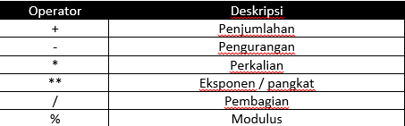
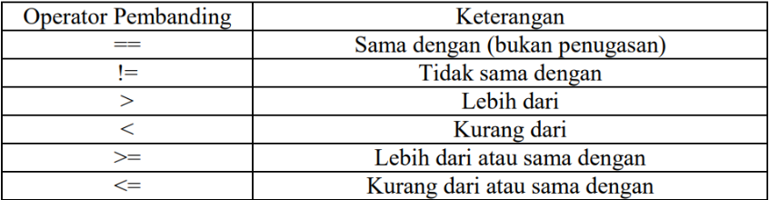

# BASIC SYNTAX

Python merupakan bahasa pemrograman yang memiliki syntaks yang relatif sederhana dan mudah untuk dipelajari. Maka dari itu, berikut merupakan beberapa sytaks dasar Python :

## Comment

Comment merupakan sebuah catatan yang dapat dimasukkan kedalam kode untuk menjelaskan apa yang dilakukan oleh kode tersebut. Comment diawali dengan tanda pagar(#).

```
# Ini komen pada baris pertama
# ini komen pada baris kedua

"""
Ini adalah multi-line comment atau bisa disebut juga docs string

dengan cara ini dapat membuat suatu dokumentasi.
untuk pembahasan lebih lanjut akan dijelaskan pada (type data string)
"""
```

## Indentasi

Merupakan suatu cara untuk menandai blok kode. Tidak seperti bahasa lain yang biasanya menggunkan kurung kurawal `{}` . Python menggunakan **indentasi**(pergeseran baris kode kekanan) untuk menunjukkan hierarki atau struktur kode. Indentasi standar di Python adalah 2 atau 4 spasi.

contoh :

```
if 5 > 3:
    print('5 lebih besar dari 3')
print("ini diluar blok if")

if 10 > 3:
print('10 lebih besar dari 3') # Blok ini akan eror
```

## Variabel

Variable merupakan tempat penyimpanan dari suatu nilai dengan type data berbeda. Artinya viriabel pada python nilai nya dapat berubah-ubah. Variabel biasanya diberi nama dengan huruf, angka, atau tanda underscore(\_). Nama variabel bersifat case sensitif (yang berarti perbedaan ukuran huruf besar atau kecil sangat berpengaruh).

Berikut adalah aturan penulisan variabel pada Python :

- Karakter pertama harus berupa huruf atau underscore(\_).
- Karakter selanjutnya boleh berupa huruf, underscore(\_), atau angka.
- Nama variabel tidak boleh menggunakan kata kunci yang sudah ada atau perintah dalam python, seperti `if`, `while`, `for`, dsb.
- Nama variabel boleh 1 karakter.

Contoh penulisan variabel pada Python :

```
# Variabel String(str)
nama = "Bang Tata"
alamat = "Basement TULT"

# Variabel Numerik
Umur = 17
T_Badan = 171.9

# Variabel Boolean
asistenIMV = True
AsistenCPS = False

# Variabel List
Angka = [1, 2, 3, 4, 5]

# Variabel Tuple
Hari_Libur = ('sabtu', 'minggu')

# variabel Dictionary
data = {"nama" : "Tata", "Alamat": "Jl. Bubat"}
```

## Statement

Statement adalah instruksi yang diberikan kepada komputer untuk melakukan atau menjalanan suatu perintah. Berbeda dengan bahasa lain, python tidak mengharuskan mengakhiri statement dengan tanda titik koma (;).

Ada beberapa jenis statement pada Python:

- Assignment Statement untuk memasukkan nilai ke variabel.
- Arithmetic Statement untuk melakukan operasi aritmatika.
- Comparison Statement untuk membandingkan 2 nilai.
- Logical Statement untuk menggabungkan dua atau lebih pernyataan logika.
- Control flow Statement untuk mengontrol aliran eksekusi kode.

Contoh Statement pada Python :

```
# Assignment Statement
a = 10
b = 20

# Arithmatic Statement
c = a * b

# Comparison Statement
d = a == b

# Logical Statement
e = a > b and c < d

# Control flow Statement
if a > b:
    print("a lebih besar dari b")
else:
    print("b lebih besar dari a)
```

**Tambahan Materi statement**

- Arithmatic Statement

  

- Comparison Statement

  

- Logical Statement

  
