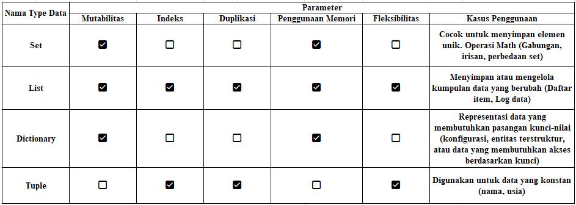

# TIPE DATA

Tipe data merupakan klasifikasi dari data yang disimpan dalam variabel. Pada python, tipe data dibagi menjadi 2 kategori utama, yaitu :

## **Tipe Data Primitif**

Merupakan tipe data dasar dari berbagai bahasa pemrograman, salah satunya python. Pada python sendiri tipe data primitif adalah sebagai berikut :

- Integer

  Tipe data yang menyimpan bilangan bulat. Integer dapat berupa bilangan bulat positif, negatif, atau nol.

  ```
  Umur = 20
  tahun = 2000
  nilai = 0
  Suhu = -10
  ```

- Float

  Tipe data untuk bilangan desimal. Dapat berupa bilangan desimal positif, negatif, atau nol.

  ```
  tinggi = 121.1
  suhu = 0.0
  ```

- String

  Tipe data yang menyimpan text. Dapat berupa karakter, kata, kalimat, atau bahkan paragraf.

  ```
  Nama = 'Andini'
  Status = "Mahasiswi"

  multi_line = """ dengan tipe data ini bisa buat paragraf, puisi, dll"""
  ```

- Boolean

  Tipe data untuk menyimpan nilai logika.

  ```
  True or False aja pokoknya.

  a = True
  b = False
  c = not a # False
  d = not b # True
  ```

## **Tipe Data Kompleks**

Tipe data yang didalamnya terdapat atau terdiri dari berbagai macam tipe. Tipe data kompleks pada python adalah sebagai berikut :

- List
  Tipe data yang dapat menyimpan kumpulan data. List dapat berupa kumpulan bilangan, string, atau kumpulan data kompleks lainnya.
  ```
  angka = [1,1,2,3,4,10] # List of integer
  nama = ["Nur", "Winana", "Nisa"] # List of string
  data = [1, "IMV", True, (1,0.5,8)] # List of mixed data types
  ```

* Tuple

  Tipe data yang berfungsi menyimpan kumpulan data yang tidak dapat diubah (Immutable). Tuple dapat berupa kumpulan bilangan, string, atau kumpulan data kompleks lainnya.

  ```
  Acara_imv = ("openlab", "IMV Transfer Learning") # Tuple of string
  data = (1, "Dini", 2021, "Asisten IMV") # tuple of mixed types
  ```

* Set

  Merupakan kumpulan data yang tidak memiliki urutan.

  ```
  bilangan = {1,2,0,100,-2,0.4} # Set of Numerik
  lab = {'IMV', '2023', "kaya! Kaya! Kaya!"} # Set of String
  mixed = {1, "Jhon doe", True} # Set of Mixed types
  ```

* Dictionary

  Tipe data yang digunakan untuk menyimpan pasangan **key** - **value** (kunci-nilai). Directory dapat digunakan untuk menyimpan data dalam bentuk tabel. Setiap item dipisahkan oleh tanda titik dua `:`

  ```
  biodata = {
  'nama' : 'Muhammad Dawwam',
  'alamat': 'Telkom University Landmark Tower Lantai 11 no 08 (TULT 11.08)',
  'jurusan': 'Teknik Telekomunikasi',
  'umur': 78,
  'is_married': True,
  'tinggi_badan': 309.62,
  'laboratorium': ('Daskom','IMV'),
  'murid': {
    'nama': 'Ridwan Maulana Tanjung',
    'alamat': 'Perumahan Bogor Ogah Geser Blok B1, No 7',
    'jurusan': 'Teknik Fisika',
    'is_married': False,
    'matkul_fav': ['Kalkulus', 'Pengolahan Sinyal', 'Elektromagnetika', 'Fisika Modern'],
    }
  }
  ```

Setelah membahas berbagai macam Type data yang ada, selanjutnya kita akan membahas tentang perbedaan dari set, list, dictionary, dan tuple berdasarkan beberapa aspek, mulai dari **mutabilitas**, **indeks**, **duplikasi**, **penggunaan memory**, **fleksibilitas**, dan **kasus penggunaan**.



- Mutabilitas

  - **Mutable** : Data dapat dimodifikasi, ditambah, atau dihapus setelah membuat.

  * **Immutable** : Data tidak dapat diubah setelah didefinisikan. Jika mau diubah harus membuat ulang struktur datanya.

- Indeks

  - **Indeks** : Struktur data yang memiliki posisi tertentu untuk setiap elemen, sehingga elemen dapat diakses menggunakan indeks (Kunci untuk Dictionary).

  * **Tidak Indeks** : Elemen tidak memiliki memiliki urutan posisi.

- Duplikasi

  - **Dapat Diduplikasi** : Elemen yang sama dapat ditambahkan berkali-kali.

  * **Tidak Mengizinkan Duplikasi** : Elemen harus unik dan tidak boleh ada elemen identik.

- Penggunaan Memori

  - Struktur data yang **Mutable** biasanya menggunakan lebih banyak memori karena perlu menyediakan ruang untuk perubahan.

  * Struktur data yang **Imutable** sering kali lebih efisien dalam penggunaan memori.

- Fleksibilitas

  - Struktur data yang **Fleksibel** bisa digunakan diberbagai kasus dan bisa disesuaikan untuk berbagai kebutuhan.

  * Struktur data **Kurang Fleksibel** memiliki kegunaan yang terbatas, tetapi lebih efisien atau aman untuk data tetap.
